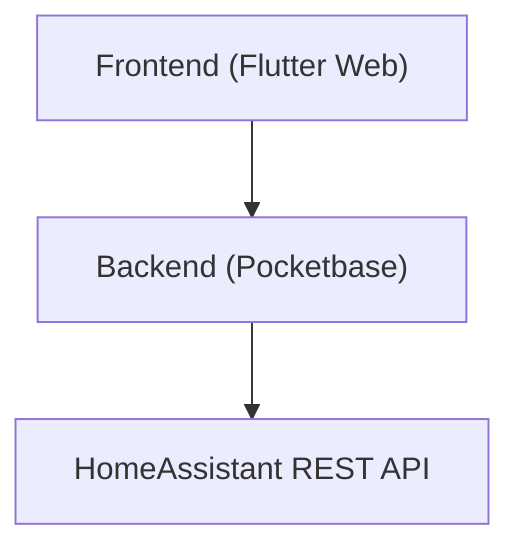

# Limited time open access to HomeAssistant lock entities

Little app to give out tokens that together with a door token can grant
limited time access to open a HomeAssistant lock entity.

Built for my personal needs, if you want to deploy this you're on your own.

The entire frontend is vibe coded, sorry...

## Local Testing

Pinned dependency versions are tracked in `tool/dependency_baseline.json` and
consumed by local test infrastructure (`docker/local-test/Dockerfile`) plus CI.
Before changing pinned versions, update the baseline file first, then align the
runtime files and verify with:

```bash
cd app && flutter test test/tool/check_dependency_baseline_test.dart -r expanded
```

Run the full local test suite in Docker:

```bash
make test
```

Run in fail-fast mode (stop on the first failing stage):

```bash
make test TEST_FAIL_FAST=1
```

By default local tests run in an `linux/amd64` container so Chrome integration
tests are consistent on both Intel and Apple Silicon hosts. Override with:

```bash
make test TEST_PLATFORM=linux/arm64
```

Integration tests require Chrome and ChromeDriver major versions to match.
The pinned Chrome for Testing version in `tool/dependency_baseline.json` must
stay compatible with the ChromeDriver bundled by `docker/local-test/Dockerfile`.

Stage order and meaning:

1. `flutter pub get`: resolves and installs Dart/Flutter dependencies inside the test container.
2. Widget tests: runs the Flutter unit/widget test suite.
3. Integration tests: starts local test infrastructure and executes integration flows.

Default behavior runs all stages and prints a final summary, even if one stage fails.

## Production Setup

1. Deploy Pocketbase
2. Load schema and hooks into Pocketbase
3. Create a `doorlock_users` record via Pocketbase admin UI
4. Deploy Flutter Web app
5. Sign into Flutter Web app
6. Create HomeAssistant connection
7. Create lock -> Print its QR code and hang it on your door or so.
8. Create grant -> Distribute link to your friend.

## Architecture



`doorlock_users` are admins of the app, they can connect a HomeAssistant instance,
connect lock entities and create grants. Grants are limited time access to open the lock
via the app. A grant is a shareable link, the link contains a token giving access to the user
side of the app. To open the lock from there the user in addition needs to scan a QR code
containing a token for the lock. This is to ensure the user is actually in front of the (right)
door and doesn't just trigger the opening remotely by accident.

## Flow

1. Sign into the frontend app
2. Add a HomeAssistant instance
3. Add a lock entity
4. Print the lock's QR code, place it outside the door.
5. Create a grant, share it's link with the person you want to give access to.
6. The user follows the link and is prompted to scan the lock QR code.
7. After successfully scanning the code, the user can open the lock.